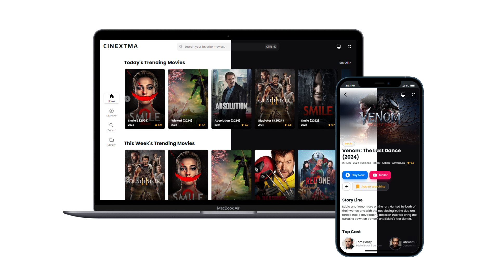

# CineVerse - Vũ Trụ Điện Ảnh

🎬 CineVerse – Vũ trụ nội dung số dành cho thế hệ mới
CineVerse là nền tảng giải trí đa phương tiện do AN KUN STUDIO phát triển, hướng đến việc xây dựng một “vũ trụ điện ảnh” dành cho thế hệ Gen Z và cộng đồng yêu thích nội dung số. Không bị ràng buộc bởi mô hình truyền thống, CineVerse cho phép phân phối linh hoạt các loại nội dung như phim điện ảnh, chương trình truyền hình, video theo yêu cầu (VOD), podcast và các sản phẩm sáng tạo khác.

🌟 Điểm nổi bật

- Nội dung linh hoạt
Không bắt buộc phải có phim điện ảnh hay TV truyền thống – CineVerse hỗ trợ cả nội dung gốc, phim ngắn, talkshow, podcast video, và các dự án sáng tạo độc lập.
- Phân phối VOD thông minh
Hệ thống phân phối video theo yêu cầu giúp người sáng tạo dễ dàng tiếp cận người xem, với tùy chọn miễn phí hoặc trả phí.
- Cộng đồng người dùng & fandom
CineVerse tạo không gian để người dùng tương tác, đánh giá, chia sẻ và xây dựng cộng đồng xung quanh nội dung yêu thích.
- Tích hợp thương mại hóa
Hỗ trợ bán merchandise, tổ chức sự kiện trực tuyến, và các hình thức thương mại hóa nội dung phù hợp với xu hướng tiêu dùng số.
- Công nghệ hiện đại
Ứng dụng các công nghệ web tiên tiến như Next.js, Tailwind CSS, Supabase, và tích hợp API nội dung để đảm bảo trải nghiệm mượt mà, đáp ứng trên mọi thiết bị.

🎯 Định hướng phát triển
CineVerse không chỉ là một nền tảng xem phim – mà là một hệ sinh thái mở, nơi nội dung được cá nhân hóa, cộng đồng được kết nối, và sáng tạo được tôn vinh. Dự án hướng đến việc:

- Hỗ trợ các nhà sáng tạo nội dung độc lập
- Xây dựng trải nghiệm giải trí tương tác
- Phân phối nội dung theo cách linh hoạt, hiện đại
- Mở rộng sang các lĩnh vực như giáo dục, nghệ thuật số, và văn hóa đại chúng

Nếu bạn muốn mình hỗ trợ viết landing page, thiết kế kiến trúc nền tảng, hoặc xây dựng chiến lược nội dung cho CineVerse, mình sẵn sàng đồng hành cùng bạn. Bạn muốn triển khai phần nào trước?
