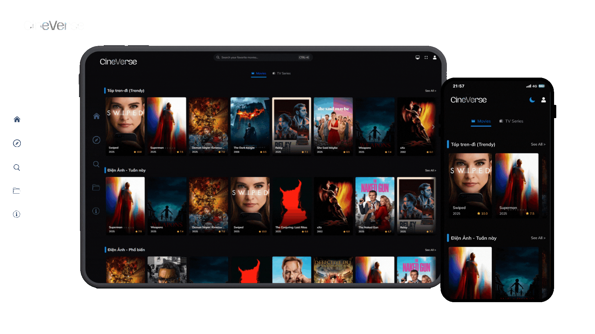

# CineVerse - Vũ Trụ Điện Ảnh

An Kun Studio hân hạnh giới thiệu dự án CineVerse - Vũ trụ điện ảnh

🎬 CineVerse – Vũ trụ nội dung số dành cho thế hệ mới CineVerse là nền tảng giải trí đa phương tiện do AN KUN STUDIO phát triển, hướng đến việc xây dựng một “vũ trụ điện ảnh” dành cho thế hệ Gen Z và cộng đồng yêu thích nội dung số. Không bị ràng buộc bởi mô hình truyền thống, CineVerse cho phép phân phối linh hoạt các loại nội dung như phim điện ảnh, chương trình truyền hình, video theo yêu cầu (VOD), podcast và các sản phẩm sáng tạo khác.

🌟 Điểm nổi bật

- Phân định rõ ràng được xác định với 2 thể loại: Chương Trình TV - Điện Ảnh
- Nội dung linh hoạt CineVerse hỗ trợ:

- Với các tab như Anime, Phim mới ra rạp, phim bộ, phim lẻ... và nội dung gốc sạch, rõ ràng, không chèn linh tinh như quảng cáo, cá độ, luôn luôn cập nhật mới.

         Nội dung lồng tiếng:

- Chỉ định quốc gia: Vi_VN
- Ngôn ngữ mã nguồn: React, Node, Typerscript, Javascript, hỗ trợ tùy chỉnh dữ liệu vùng quốc gia mặc định khi phiên bản toàn cầu

- Phân phối VOD thông minh Hệ thống phân phối video theo yêu cầu giúp người sáng tạo dễ dàng tiếp cận người xem, với tùy chọn miễn phí hoặc trả phí (Chưa cố kế hoạch trả phí).
- Cộng đồng người dùng & fandom CineVerse tạo không gian để người dùng tương tác, đánh giá, chia sẻ và xây dựng cộng đồng xung quanh nội dung yêu thích, có thể cập nhật và thêm thắt các thông tin hiển thị.
- Tích hợp các thông tin về tác phẩm phái sinh như âm nhạc, Show Mini, ...
- Công nghệ hiện đại Ứng dụng các công nghệ web tiên tiến như Next.js, Tailwind CSS, Supabase, và tích hợp API nội dung để đảm bảo trải nghiệm mượt mà, đáp ứng trên mọi thiết bị.

🎯 Định hướng phát triển CineVerse không chỉ là một nền tảng xem phim – mà là một hệ sinh thái mở, nơi nội dung được cá nhân hóa, cộng đồng được kết nối, và sáng tạo được tôn vinh. Dự án hướng đến việc:

- Hỗ trợ các nhà sáng tạo nội dung độc lập trong việc xây dựng cơ sở ban đầu
- Xây dựng trải nghiệm giải trí tương tác từ website đến các thiết bị khác nhau như TV, Tablet, Mobile...
- Phân phối nội dung theo cách linh hoạt, hiện đại và có yếu tố liên quan như tin tức, sản phẩm liên quan như âm nhạc, các sự kiến được tổ chức như off fans, bầy bán, trình diễn (nếu có)

Nếu bạn muốn mình tham gia với tư cách thành viên chính của dự án, đừng ngần ngại bày tỏ và tham gia.
Dự án vẫn đang trong quá trình hoàn thiện vì vậy không có gì là hoàn hảo. Mong bạn bớt chút thời gian cho ý kiến và đóng góp. Nếu dự án có gây ra khó chịu trong thời gian này, thì mong bạn hiểu và thông cản cho đứa tay mơ như mình

## Xin trân trọng cảm ơn và hẹn gặp nếu có cơ hội

Liên kết với mình tại [An Kun với Bio](https://bio.site/ankun) hoặc [An Kun với xã hội](https://ankunstudio.info)
